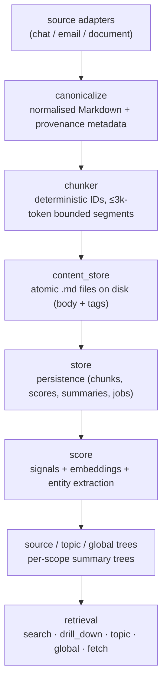
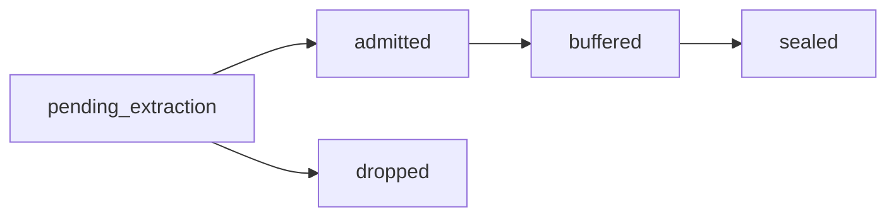

# Memory Tree

The Memory Tree is OpenHuman's knowledge base. It is not a vector database with a thin "memory" wrapper. It is a deterministic, bucket-sealed pipeline that turns the messy stream of your day - chats, emails, documents, integration sync results - into structured, queryable, summary-backed Markdown that lives on your machine.

## What it does

Every source you connect feeds the same pipeline:

The hot path (canonicalize → chunk → fast-score → persist → enqueue follow-up work) is fast. Heavy work - embeddings, entity extraction, sealing summary buckets, daily digests - runs in background workers so the UI never blocks.

Embeddings and summary-tree building can run **on-device via Ollama** if you turn on [Local AI](../model-routing/local-ai.md); otherwise they go through the OpenHuman backend like any other model call.

## Three trees, three scopes

* **Source trees**, per-source rolling buffer (L0) that seals into L1 → L2 → … as it fills. One per Gmail label, one per Slack channel, one per uploaded document, etc.
* **Topic trees**, per-entity summaries materialized lazily by _hotness_. The more an entity (person, project, ticker, repo) shows up, the more aggressively its topic tree is built and refreshed.
* **Global tree**, one daily global digest across everything ingested that day.

Retrieval can target any scope: search a single source, drill down a topic, or pull the global digest.

## Where it lives on disk

Inside your workspace (default `~/.openhuman`, or whatever `OPENHUMAN_WORKSPACE` points at):

| Path                    | What's there                                                    |
| ----------------------- | --------------------------------------------------------------- |
| `memory_tree/chunks.db` | Chunks, scores, summaries, entity index, jobs, hotness          |
| `wiki/`                 | The Markdown vault - see [Obsidian Wiki](./)                    |

Everything is local. Nothing about your raw data leaves your machine unless you explicitly send a chat message that includes it.

## Why a tree, not a vector store

Vector stores answer "what is similar to this query?" Memory needs to answer more than that:

* **What happened today?** (global digest)
* **What's the latest on this person?** (topic tree, hotness-driven)
* **What did the Stripe webhook say last Tuesday at 3pm?** (source tree + provenance)

Trees give you compression _and_ navigation. Embeddings still live inside so semantic search keeps working, but the structure on top is what makes the memory feel like a brain instead of a bag of fragments.

## How the pipeline works

The user-facing pitch is simple: connect a source, the agent gets persistent memory of it. The pipeline that delivers on that pitch spans an HTTP-triggered ingest path, a durable job queue, a pool of background workers, three independent summary trees, and a daily UTC scheduler.

The diagram below is the source of truth.


Memory Tree Async Pipeline - leaf ingestion → jobs queue → workers → source / topic / global tree building.


### 1. Ingest

A new chat / email / document arrives. The hot path canonicalizes it into Markdown, splits it into bounded chunks with deterministic IDs, runs a cheap fast-score, persists everything in a single transaction, marks each chunk as `pending_extraction`, and enqueues follow-up work for the workers.

Three properties matter here:

* **Deterministic.** Chunk IDs are content-addressed, so re-running ingest on identical input never produces duplicates.
* **Fast.** No LLM calls in this lane - only cheap heuristics.
* **Bounded write.** Everything happens in one transaction so a partial ingest can't leave dangling rows.

### 2. Queue

Follow-up work lands in a durable job queue (in the same on-disk store as the chunks). Each job carries a kind, a payload, a dedupe key, retry bookkeeping, and a scheduling window. The kinds:

| Kind             | What it does                                                                                  |
| ---------------- | --------------------------------------------------------------------------------------------- |
| `extract_chunk`  | Deep score + entity extraction. Decides `admitted` vs `dropped`.                              |
| `append_buffer`  | Adds an admitted leaf to the source (or topic) tree's L0 buffer. May trigger a seal.          |
| `seal`           | Compresses an L0 buffer into an L1 summary; cascades up if the parent buffer is now full.     |
| `topic_route`    | Routes a leaf into per-entity topic trees, gated by a hotness check.                          |
| `digest_daily`   | Builds the global daily digest node.                                                          |
| `flush_stale`    | Force-seals buffers that have been sitting too long.                                          |

### 3. Workers

A small pool of background workers (3 by default) picks jobs off the queue and runs them. The pool is woken immediately by the ingest path, with a short polling fallback so a missed wake-up doesn't strand work. A shared semaphore caps concurrent LLM-bound calls so a burst of new sources can't accidentally fan out to dozens of concurrent embeddings.

On startup, any job whose worker lease has expired (because of a crash or kill) is returned to the queue. Crashes don't lose admitted-but-not-yet-sealed work.

### 4. Tree state

Three independent trees are built from the same leaf stream.

* **Source tree** - one per source. New leaves land in the L0 buffer; when the buffer fills (or a stale-flush fires), a `seal` writes an L1 summary, and the cascade continues up.
* **Topic tree** - one per high-hotness entity. The router checks whether an entity is hot enough to deserve its own tree and, if so, appends to its buffer.
* **Global tree** - one tree, growing one node per UTC day, walked up the hierarchy as days accumulate.

### 5. Scheduler

A scheduler loop runs independently of the ingest path. At 00:00 UTC each day it enqueues a global daily digest for yesterday and a stale-flush for today. The scheduler **does not** run summarizers itself - everything goes through the queue, so retries, dedupe, and stale-lock recovery stay centralized.

### 6. Leaf lifecycle

Each chunk moves through a small state machine:

* Extraction decides `admitted` vs `dropped` based on the deep score.
* Admitted leaves move into a buffer (`buffered`).
* When the buffer seals, every leaf inside is marked `sealed`.
* `dropped` leaves stop here. Their chunk row stays for provenance, but no buffer or summary references them.

This is why retrieval can show provenance without re-running the pipeline: the chunk row plus its terminal lifecycle status is enough.

### Why a queue instead of in-process futures

* **Crash safety.** A worker panic, a process kill, a power loss - none of them lose admitted-but-not-yet-sealed work. The next start picks up where the last one left off.
* **Retries with backoff.** Per-job retries with attempt counts and scheduled re-runs, no ad-hoc retry loops in business logic.
* **One throttle for LLM cost.** All summarization paths share a single semaphore.

## Triggering ingest

* **Automatic** - every active integration is auto-fetched every twenty minutes; see [Auto-fetch](auto-fetch.md).
* **Manual** - the Memory tab in the desktop app exposes a "Run ingest" trigger per source.
* **RPC** - `openhuman.memory_tree_ingest` for advanced workflows.

## In the desktop app - the Intelligence tab

Open it from the bottom navigation bar.

**System status.** The top of the page shows the current state (idle, ingesting, summarizing) and a **Run ingest** button to manually trigger a sync against any connected source.

**Memory metrics:**

| Metric                    | What it shows                                                                                      |
| ------------------------- | -------------------------------------------------------------------------------------------------- |
| **Storage**               | Total size of `<workspace>/memory_tree/chunks.db` and the Obsidian vault.                          |
| **Sources**               | How many distinct sources have been ingested (one per Gmail label, Slack channel, document, etc.). |
| **Chunks**                | Total ≤3k-token chunks in the store.                                                               |
| **Topics**                | Number of topic trees materialized so far (per-entity summaries built from "hot" entities).        |
| **First / latest memory** | Timestamps of the oldest and newest chunks.                                                        |

**Memory graph.** A force-directed visualization of entities and their relationships, drawn from the entity index. The graph grows as auto-fetch pulls more data - sparse early on, denser within a few days.

**Obsidian vault.** A **View vault in Obsidian** button opens `<workspace>/wiki/` directly via an `obsidian://open?path=...` deep link. You can also open the folder in any file browser.

**Ingestion activity.** A heatmap showing ingest events over time, similar to a GitHub contribution graph. Useful for spotting periods where auto-fetch was idle (e.g. a connection broke and stopped syncing).

**Search & retrieval.** A search bar over the Memory Tree. Source-scoped, topic-scoped or global queries are all supported, and any result links back to the underlying chunk file in your Obsidian vault for full provenance.

**Routing.** The Intelligence tab also surfaces which model the agent is using per task - see [Automatic Model Routing](../model-routing/).

## See also

* [Obsidian Wiki](./) - open the vault in Obsidian and edit it directly.
* [Auto-fetch from Integrations](auto-fetch.md) - how the tree stays fresh.
* [Smart Token Compression](../token-compression.md) - what makes ingesting "everything" cheap.
* [Local AI (optional)](../model-routing/local-ai.md) - opt in to keep embeddings and summary-tree building on-device.
